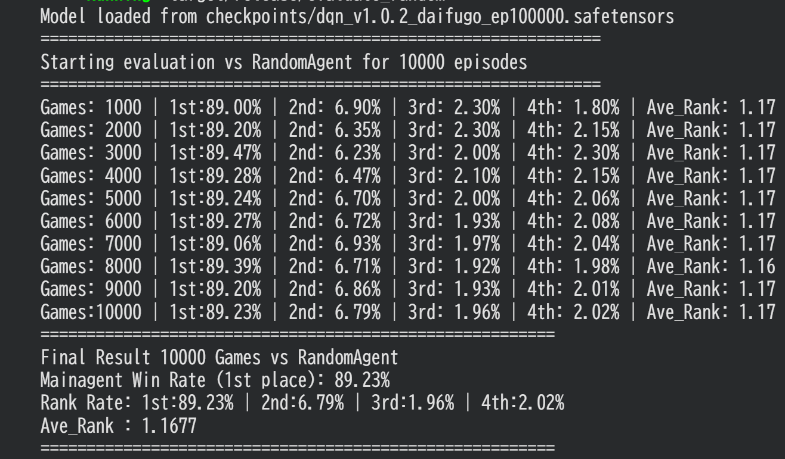

# President_RL
トランプゲームの大富豪の強化学習リポジトリです。

A 100% pure Rust implementation of a Daifugo (Japanese card game) environment and Deep Q-Network (DQN) training framework. 

大富豪のAI開発のための、**高速・ハッカブル・拡張性重視の実験用サンドボックス（ベースフレームワーク）**です。ゲームロジック（Env）、特徴量抽出（Processor）、ニューラルネットワークの構築・学習（Train）まで、Pythonを一切挟まずにRustのみで完結しています。

## ⚡ Key Benchmarks (圧倒的なパフォーマンス)

Rustによるネイティブ実装により、シミュレーションおよび学習が極めて高速に動作します。以下の数値はcolabの無料CPUでの数値です。

- **Random Agents (4つの一切NNを通さないランダムAIによるシミュレーション):**
  - **100,000試合：約15秒** (約 6,600+ games/sec)
- **DQN Training (学習・推論を回しながらのセルフプレイ学習):**
  - **100,000試合：約3時間(v1.0.2時点)**
  - **100,000試合：約4時間(8切りやJバックの判定を入れた場合)**

大富豪のような不完全情報・マルチエージェントの複雑なタスクにおいて、圧倒的な高速トライ＆エラーを可能にします。

## 💡 Motivation (開発動機)

大富豪（Daifugo）は非常にゲーム性が高く、AI開発の題材として極めて魅力的なゲームです。しかし、これまではルールベースや模倣学習のものが多く、自己対戦ができる「手軽かつ実用的な速度で強化学習（RL）を試せる大富豪の環境（Env）」がオープンソースでほとんど存在しませんでした。

本プロジェクトは、自己対戦できるdeeplearningの高速環境の土台をつくることを目的としています。

## 📋 Supported Rules & Customization

本リポジトリは、ベースとなる大富豪のルールを実装した上で、**開発者が各自でコードを直接書き換えて実験・拡張することを前提（ハッカブル）**として設計されています。

### 現在の実装ルール（デフォルト）
- **基本ルール:** 3が最弱、2が最強、ジョーカーはワイルドカード（単体時は2より強い）。
- **対応する役:** 単騎（1枚出し）、ペア（2枚出し）、3枚出し、4枚出し（革命）、階段（3枚以上）。
- **ローカルルール（RuleConfigでON/OFF切り替え）:**
  - 革命（強弱の反転）
  - 8切り
  - Jバック
- **未実装（拡張用の余白）:**
  - 縛り、5飛び、7渡し、スペ3返し、禁止あがり等（必要に応じて コードを書き換えて追加してください）。

## 🃏 Card & Action System Definition (README用記述案)
本プロジェクトでは、大富豪の複雑な「カードの状態」と「プレイヤーの選択肢（Action）」を、高速かつビット演算と親和性が高いインデックス形式で完全に一意化（シリアライズ）しています。
### 1. Card Representation (カードのインデックス定義)
すべてのカード（52枚 + ジョーカー2枚）を 0 ~ 53 の usize で一意に管理します。
 * **スート (Suit):** Spade (0), Club (1), Diamond (2), Heart (3)
 * **ランク (Rank):** 3 (0) -> 4 (1) -> ... -> A (11) -> 2 (12) と定義し、大富豪の通常の強さに準拠した内部数値（0〜12）を持たせています。
 * **インデックス変換アルゴリズム:**
   
   * 0: ♠3、12: ♠2、13: ♣3、51: ♥2
   * 52: ジョーカー1、53: ジョーカー2
### 2. Action Mapping (行動空間の定義)
大富豪の「何を場に出すか（パス、単発、ペア、階段など）」という膨大な行動空間を、シームレスにニューラルネットワークの出力層（DiscreteなアクションID）とマッピングするため、**厳密な固定長IDのエンコード/デコード機構**を実装しています。
アクション全体の総数（ACTION_SIZE）は、以下のように各プレイのパターンごとに綺麗にセグメント分けされています。
| アクションID | 行動タイプ (ActionType) | 内訳・計算ロジック |
|---|---|---|
| **0** | **Pass (パス)** | パス一択。 |
| **1 ~ 195** | **Group (重ね数字)** | 13個のランク×15通りの組み合わせ（4枚のスートから1〜4枚を選ぶ全パターン： 2^4 - 1 = 15 ） = **195通り**。枚数が4枚の時は自動で革命トリガーとなります。 |
| **196 ~ 459** | **Stair (階段)** | 4つの各スート×66通りの階段パターン（3枚〜13枚連続の全組み合わせ） = **264通り**。|
| **460** (仮) | **Joker (単発)** | ジョーカー1枚出し。強さは最強値の 13 として扱われます。 |
| **461** (仮) | **Joker (ペア)** | ジョーカー2枚出し。 |
### 3. ActionInfo & ActionManager の特徴
 * **高速なビットマスク生成（required_mask）:**
   各アクションが必要とする手札のカードインデックスを、64bit整数（u64）のビットフラグとして保持。エージェントの手札のビット列と AND 演算を行うだけで、**「今そのアクションが可能かどうか（Action Masking）」をCPU超高速で判定できる設計**になっています。
 * **スマートな「強さ（strength）」判定:**
   場に出ているカードと比較するため、そのアクションのベースとなる強さを内部で自動計算して保持しています（例：階段なら末尾のカードの強さ）。


### 3. State & Processor
環境から得られる状態は、`Processor` を介してTensor（ベクトル）に変換されてNNに入力されます。
ただし、**「何が最適な特徴量（State）か」は強化学習の最も重要な実験要素の1つ**です。現在の実装はベースラインに過ぎないため、タスクに合わせて各自で自由にStateの構成を調整・拡張してください。Processor.rsのwrite_bufを書き換えることで特徴量(state)を調整できます（INPUT_STATE_DIMは合わせてください）。
*(例：自分の手札、場のカード、流れたカードのカウンティング、他プレイヤーの残り手札枚数など)*

---

## 🔄 環境設計とゲーム制御 (Environment & Rule Engine)

本プロジェクトのコアとなる `DaifugoEnv` は、強化学習エージェントが安全かつ高速にシミュレーションを行えるよう、大富豪の複雑なフェーズやルールを完全にカプセル化しています。


### 1. 状態管理 (`RawState` とビット表現)
ゲームのあらゆる状態は `RawState` 構造体で一元管理され、メモリ効率とビット演算の速度を最大限に活かした設計になっています。

* **手札管理 (`hands: [u64; 4]`)**: 各プレイヤーの手札は64bit整数のビットマスクで管理され、配札やカードの消費、交換がすべて高速なビット演算で完結します。
* **生存フラグ (`alive_players: u8`)**: 下位4ビット（`0b1111`）でプレイヤーのゲーム継続状態を表現し、上がったプレイヤーの離脱やゲーム終了判定（残り1人以下）を即座に行います。


### 2. ルールエンジン (`RuleEvaluator`) と効果の適用
カードが場に出された際、`RuleEvaluator` が特殊効果を動的に判定し、場の状態（`Field`）へ即座に反映します。

* **8切り (`eight_cut`)**: 発動すると即座に場を流し（`current_field_action = None`）、出したプレイヤーが次の親（ターン獲得）となります。
* **Jバック (`eleven_back`)**: 発動中、その場限りの臨時の革命状態（`is_revolution` の反転）を発生させます。場が流れたタイミングで、本来の革命状態（一時的か永続か）へと自動で安全に巻き戻されます。
* **革命トリガー**: 4枚出し、または4枚以上の階段が成立した際、永続的な革命フラグ（`is_parmanent_revolution`）を反転させます。


### 3. ゲームのライフサイクル (Lifecycle & Flow)


```
[reset()] ──> (前回順位あり?) ─yes─> [カード交換フェーズ] (大富豪/富豪/貧民)
│                                      │
└───────────ノーコンプリート─────────────┘
│
▼
[ゲームプレイ開始] ──> [エージェントのターン] (DQNの行動)
│                         ▲
▼                         │
[対戦相手のターン] ─────────┘ (固定AIが自動でステップを消費)
│
▼
[check_done()] ──> 残り1人でゲーム終了 ──> [報酬の確定]
```

#### ① カード交換フェーズ (`exchange_step`)
前回の試合結果（`previous_rankings`）が存在する場合、自動的にカード交換フェーズに移行します。
* **大富豪・富豪**: 自身の手札（`legal_actions_mask` で制限された単発のカード）から、任意のカードを1枚ずつ選択して下位プレイヤーに送ります。
* **大貧民・貧民**: 自動的に手札内の**最も強いカード**（ジョーカー、または通常のランクが高い順）を抽出（`extract_strongest_cards`）し、上位プレイヤーへ自動的に仮抜き・転送します。
* **都落ちの準備**: 開始プレイヤーの制御ロジックなど、スムーズな連戦が行える土台が構築されています。

#### ② ジョーカーの自動代用システム (`apply_action`)
エージェントが「階段」や「ペア」を出す際、通常のリアルカードが不足していても、**手札にあるジョーカー（52, 53番）を自動的に消費して不足分を補う代用ロジック**が組み込まれています。これにより、エージェントは「ジョーカーを何に化けさせるか」を個別で選ぶ必要がなく、アクションIDを指定するだけで合法手として処理されます。

#### ③ ターン解決と自動ステップ進行 (`step`)
* **相手ターンの自動化**: エージェント（自分）以外のプレイヤーのターンは、内部で `opponent_turn()` が自動かつループで実行されます。自分のターンが回ってくるか、ゲームが終了するまで内部ステップが進むため、強化学習側からは**「行動を選択したら、即座に次の自分の番の状態（State）と報酬が返ってくる」**というシンプルな1ステップとして扱えます。


### 4. 報酬設計 (Reward Scheme)

ゲーム終了時、確定した順位（`finished_order`）に基づいて、各プレイヤーへ以下の固定報酬ベクトル（エージェント間での総和が `0` になるゼロサムゲーム形式）が分配されます。

| 順位 | 役割（4人時） | 報酬値 (`f32`) | 設計意図 |
| :---: | :--- | :---: | :--- |
| **1位** | 大富豪 | **`+1.0`** | 勝利への最大インセンティブ |
| **2位** | 富豪 | **`+0.3`** | プラスを維持しつつ、1位との差を設定 |
| **3位** | 貧民 | **`-0.3`** | 負けへのペナルティの入り口 |
| **4位** | 大貧民 | **`-1.0`** | 最悪のペナルティによる回避学習 |

> 💡 **ポイント:**
> 順位ごとの報酬に明確な勾配（差）をつけることで、エージェントが「少しでも上の順位を目指す」「大貧民だけは絶対に回避する」という、大富豪特有のシビアな生存戦略を効率よく学習できるように最適化されています。

---

## 🧠 変則的な手札交換の学習パイプライン (Advanced Experience Buffer Handling)

大富豪の強化学習を実装する上で難所の1つが、**「カード交換フェーズにおける経験（Transition: $s, a, r, s'$）の収集」**です。
本プロジェクトでは `Trainer` 内部で、エージェントの階級（前回の順位）と環境のターン進行（`exchange_turn_idx`）のズレを完全に吸収し、バッファへの整合性を保つ特殊なハンドリングを行っています。


### ⚠️ カード交換時の課題と設計思想
通常のゲームプレイ（`step`）では、「自分の行動」の直後に環境が更新されて次の状態が返ります。しかし、カード交換（`exchange_step`）は以下の理由からタイムラグや視点のねじれが発生します。

1. **大富豪（2枚出す）の場合**: NNに手札交換を選択させるためには462個のaction空間では、必ず外側からenvのexchange_stepを2回呼ぶ必要があります。
2. **富豪（1枚出す）の場合**: 選択回数は1回で1回で良いですが、stateが大富豪が交換した直後のものになります。

本フレームワークでは、このねじれを解決するため、自身の階級（`previous_my_rank`）に応じてバッファ（`Experience Replay`）への追加タイミングを動的にスイッチングしています。

---

### 📥 階級別の遷移データ収集ロジック
#### 🥇 エージェントが「大富豪（Rank 0）」の場合
大富豪はカードを2枚差し出しますが、1枚目と2枚目で環境の挙動が異なるため、バッファへの追加タイミングを緻密にコントロールしています。
 * **1枚目の選択時**:
   1枚目を出した直後の next_exchange_state は、まだ大富豪自身の手番（2枚目を選ぶ状態）であり、マスクも大富豪のものです。そのため、ここは通常通り (state, action, reward, next_exchange_state) としてそのままバッファに即座に挿入します。
 * **2枚目の選択時**:
   2枚目を出した直後の状態は、環境の仕様上、**次の手番である「富豪」の合法手マスクに切り替わってしまいます**。大富豪のニューラルネットワークに「富豪のマスクを持った状態」を学習させるわけにはいかないため、ここでは即座にバッファに入れず、アクション前の状態を daifugo_s、行動を daifugo_a として一時的にスタック（退避）させます。
 * **交換コミット時**:
   その後、富豪の交換や貧民層からの自動転送がすべて完了し、ゲームプレイが始まる直前の**「実際に相手からカードが返ってきて、大富豪としての手札が最終確定した状態（s'）」**を取得したタイミングで、スタックしておいた daifugo_s, daifugo_a と紐付けてバッファに挿入します。
#### 🥈 エージェントが「富豪（Rank 1）」の場合
富豪（1枚差し出し）の場合も、自分がカードを出した直後は環境のフェーズが動き、大貧民や貧民の自動転送処理へと流れていきます。
 * **カード選択前**:
   大富豪の交換が終わり、自分に手番が回ってきた時点のクリアな状態を fugo_s として一時スタックします。
 * **交換コミット時**:
   自身がカードを差し出し、環境側で全プレイヤーのカード交換が完全にコミットされた直後の next_state（＝ゲームプレイが始まる瞬間の手札）と、スタックしておいた fugo_s・自身の行動を紐付けてバッファへ挿入します。


### ⚙️ 自己対戦（Self-Play）の自動アップデート
`Trainer` は一定エピソード（デフォルト: 3000エピソード）ごとに、それまで学習していたメインの `DQNAgent` のウェイトを対戦相手（`Opponent::DQN`）へ自動的にコピー（`copy_weights_to`）します。
これにより、エージェントは「過去の少し弱い自分」や「最新の洗練された自分」と常に戦い続ける形となり、固定AI相手では発生しがちな**局所最適（ハメ技の学習）を回避し、強固な大富豪AIへ自律的に進化**していきます。

---

## 🧠 ネットワークアーキテクチャ (Neural Network Architecture)
本プロジェクトでは、大富豪の複雑な盤面評価と合法手の選択を高度に最適化するため、**Pre-LN型の残差ブロック（Residual Block）を搭載したDueling Network**を100% Rust（candle-core / candle-nn）で実装しています。
### 1. ネットワーク構造の概要
```
入力 (State)
     │
     ▼
 [input_layer (Linear)]
     │
     ▼
  (ReLU)
     │
     ▼
 [res (ResidualBlock)]
     │
     ▼
 [final_ln (LayerNorm)] ─── 特徴量抽出のメイン幹（ここまで1本道）
     │
     ├───> Value Stream ──────> [value_buffer] ──> (ReLU) ──> [value (Linear: 1)] ───────┐
     │                                                                                    ▼
     └───> Advantage Stream ──> [advantage_buffer] ─> (ReLU) ─> [advantage (Linear: Act)] ─> [Q値の統合 (q)]

```
#### ① 特徴量抽出のメイン幹（共通レイヤー）
状態（State）はまず最初に共通のネットワークを通り、大富豪の盤面から高度な特徴量を抽出します。
 * **input_layer & ReLU**: 入力ベクトルを隠れ層（hidden_dim）の次元へマッピング。
 * **res (ResidualBlock)**: 勾配消失を防ぐPre-LN型の残差接続。
 * **final_ln**: 抽出された特徴量を、ストリーム分岐の直前で安全に正規化します。
#### ② Dueling Architecture（ストリームの分岐）
final_ln を抜けた直後、データは完全に独立した2つのストリームへ同時に流れ込みます。
 * **Value Stream (状態価値 V)**: 盤面そのものの有利・不利を単一の数値（1 次元）で評価します。
 * **Advantage Stream (行動優位度 A)**: その盤面において、各行動（action_dim 次元）が他の行動に比べてどれくらい価値があるかを評価します。
最終的に、この2つが後述する「マスク対応型アドバンテージ結合」によって統合され、各行動の最終的なQ値が算出されます。

### 🛠️ マスク対応型アドバンテージ結合（テクニカル・ハイライト）
Dueling Networkの標準的なQ値の結合式は以下の通りです。

しかし、大富豪には「手札にないカードは出せない」という強力な**アクションマスク**が存在します。出せない行動（一律で0にマスクされたAdvantage）まで含めて単純平均（/|A|）を取ってしまうと、アドバンテージの計算が歪み、学習が著しく不安定になります。
本プロジェクトでは、この問題を解決するため、**「有効な行動の数だけを動的にカウントして平均を取る」マスク対応型の結合ロジック**をテンソル演算のみで高速に処理しています。
```rust
// 1. 合法手のみのアドバンテージを抽出
let masked_a = a.broadcast_mul(mask)?;

// 2. 有効な行動（マスクが1の要素）の数をバッチごとにカウント (ゼロ除算防止の微小値を加算)
let legal_counts = mask.sum_keepdim(1)?.affine(1.0, 1e-8)?;

// 3. 有効な行動のみの平均（Mean）を算出
let a_mean = masked_a.sum_keepdim(1)?.broadcast_div(&legal_counts)?;

// 4. 平均を引いて中心化し、再度マスクを適用してQ値を算出
let advantage_centered = a.broadcast_sub(&a_mean)?.broadcast_mul(mask)?;
let q = advantage_centered.broadcast_add(&v)?;

```
### ✨ この実装がもたらすメリット
 * **不正なQ値の排除**: マスクされた（打てない）行動のQ値が正確に補正され、エージェントが「出せないカードを出そうとする無駄な探索」を劇的に減らします。
 * **純粋なRust演算**: PyTorch 等の外部ライブラリを一切呼ばず、Candle のネイティブなテンソル演算だけで完結しているため、GPU/CPUを問わず最高のパフォーマンスを発揮します。

---


## 🛠️ Usage & Experimentation (使い方と実験方法)

本プロジェクトは、`bin` ディレクトリ内の各実行ファイルを開発者が直接いじって実験をコントロールするスタイルを採用しています。

1. **設定のカスタマイズ**
   `src/bin/train.rs` などの実行ファイルを開き、有効にしたいローカルルール（8切り、Jバック等）のフラグや、ハイパーパラメータを直接書き換えます。
   
2. **実行 (Cargoコマンド)**
   設定後、リリースモードでバイナリを指定して実行します。
   ```bash
   
   # 学習の実行
   cargo run --release --bin train

---

## 学習結果例

ランダム相手に余裕で勝ち越せています。



>図:革命あり/階段あり/8切り等なし


